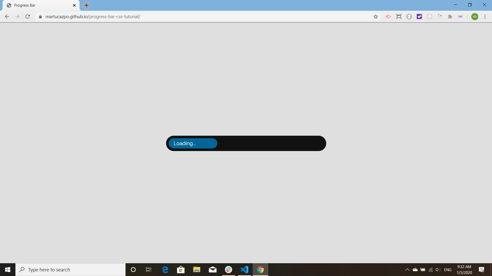
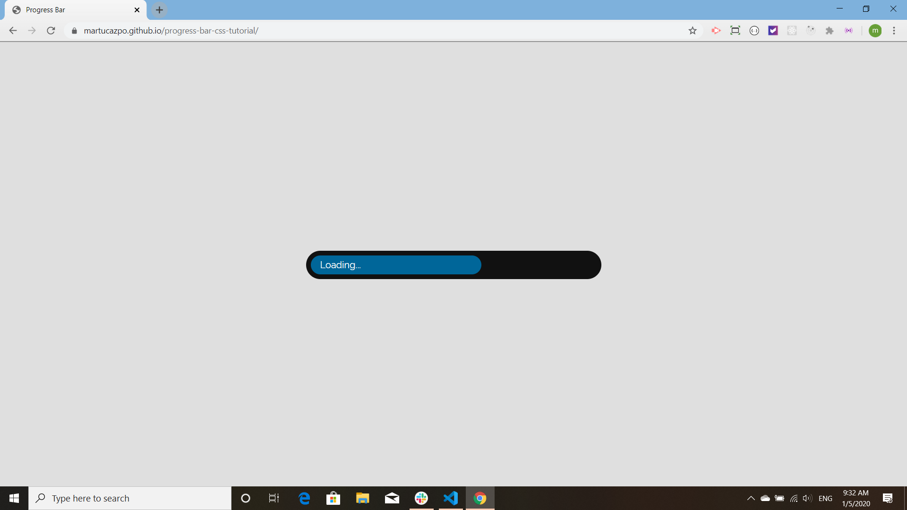
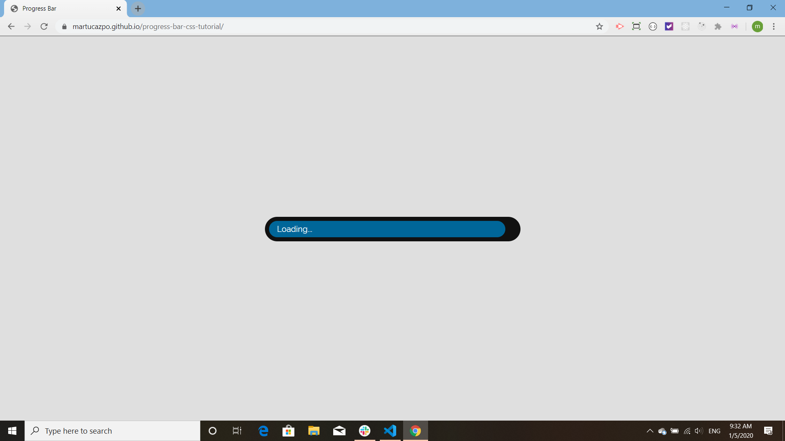

# progress-bar-css-tutorial

This progress bar is a [tutorial](https://www.youtube.com/watch?v=basf1lH1H-E&list=PLZlA0Gpn_vH8mpXIUHjWoMAAgoCEinL0R&index=4&t=0s) from [Web Dev Simplified](https://www.youtube.com/channel/UCFbNIlppjAuEX4znoulh0Cw). None of the code is mine. It is part of a playlist of tutorials that I am doing to improve my knowledge of CSS.

The following images illustrate the progress bar growing:

My rendering of this tutorial is [published on Git Hub](https://martucazpo.github.io/progress-bar-css-tutorial/).
